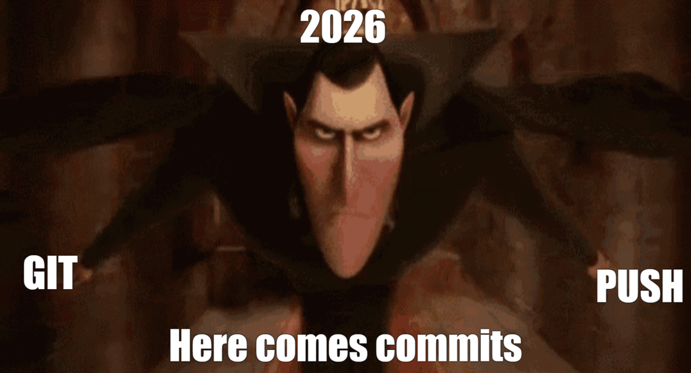

<h1 align = "center">We are IEEE-VIT. 🚀</h1>

  

  <b><i>IDEATE. INNOVATE. INSPIRE.</i></b>  

  IEEE VIT is a community comprising the most persevering of student developers, designers, and managers. Our ever-growing arsenal of projects covers a range of domains and technologies, from Web Development and App Development to Machine Learning and Electronics. 

  We 💙 open-source development. If you're here, chances are you do too! Contribute to our <a href="https://github.com/orgs/IEEE-VIT/repositories">projects</a>!  

---

  
    IEEE offers a range of exciting projects across diverse disciplines, ready for your innovative touch in 2026! 🥳

 
<b>🛳️ January @ IEEE VIT sets sail with fresh momentum, vibrant energy on the surface, engineered systems powering everything below deck. ⚙️</b>

   
  🌴 Fresh start. Smooth workflows. Zero chaos. 🌴  
  ✨ January isn’t just about taking a break, it’s about building tech that runs effortlessly in the background. Clean architectures, reliable pipelines, well tested features, and code that stays calm even when traffic spikes. ✨

   
   “Great engineering is like a perfect vacation cruise 
   everything looks easy, but it’s powered by precision.
   Clear ownership, thoughtful design, and teamwork that keeps things moving.
   Because when systems are built right… users just enjoy the ride.” 🚢💻

  <a>⚓</a>

  <a href="https://youtu.be/AUWgzmwluJE?si=MbdvkHVyMTg6EdBQ&t=42" target="_blank">🧛🏼</a>

