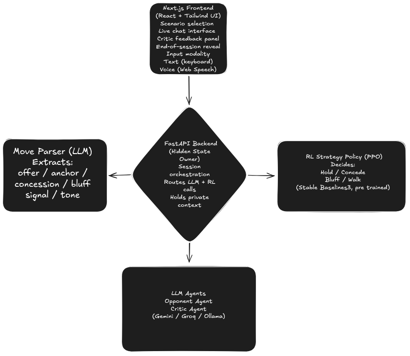

<h1 align = "center">We are IEEE-VIT. 🚀</h1>

  

  <b><i>IDEATE. INNOVATE. INSPIRE.</i></b>  

  IEEE VIT is a community comprising the most persevering of student developers, designers, and managers. Our ever-growing arsenal of projects covers a range of domains and technologies, from Web Development and App Development to Machine Learning and Electronics.

  We 💙 open-source development. If you're here, chances are you do too! Contribute to our <a href="https://github.com/orgs/IEEE-VIT/repositories">projects</a>!  

---

  
    IEEE offers a range of exciting projects across diverse disciplines, ready for your innovative touch in 2026! 🥳

 

  <b>July @ IEEE VIT is about depth, discipline, and building things that matter.</b>

   
  Sharper execution, cleaner systems, and code that holds up under pressure. Less noise. More signal. Real ownership. 

   July is not about doing more. 
  It is about doing it right.
From late night debugging sessions to architecture decisions that actually scale, from thoughtful code reviews to features shipped with intention, every commit this month carries weight, purpose, and team.

   
   "The best engineering does not announce itself. It just works.
   Built carefully. Tested honestly. Improved relentlessly.
   Solid foundations. Clear thinking. Shared accountability.
   Because when a team builds with discipline, the work speaks for itself."

  <a href="https://youtu.be/KtlgYxa6BMU?si=Pz9aFMNoOWr7031W&t=85" target="_blank">🕺🏼</a>

 <h2>July's Project of the Month</h2>

  <b>
    <a href="https://github.com/IEEE-VIT/ParleyLab">ParleyLab</a>
  </b>

   
  ParleyLab is an AI-powered negotiation training simulator. Users practice structured negotiation scenarios, salary offers, freelance contracts, apartment leases, and equity splits against an AI opponent whose strategy is driven by a trained PPO reinforcement learning agent and whose dialogue is generated by an LLM. After each move, an independent critic agent evaluates the user's technique in real time against established negotiation theory.

  The core architectural decision is the decoupling of strategy from language: the PPO policy decides what the opponent does (hold firm, concede, bluff, walk   away), and the LLM independently translates that decision into natural language. This keeps strategic behavior principled and consistent while keeping dialogue natural and persona specific.
   
   

## Features

* **Four built in negotiation scenarios (salary, freelance contract, rent, equity split):** Each scenario ships with a distinct opponent persona, hidden BATNA, target price, and urgency profile that the user never sees until the session ends.
* **RL driven opponent strategy:** A PPO agent (Stable Baselines3, trained for 1M timesteps across five difficulty levels) controls strategic decisions including Hold Firm, Concede Small, Concede Large, Bluff, and Walk Away, independently of language generation. Per turn inference runs in sub millisecond on CPU.
* **Per turn critic feedback:** An independent critic LLM evaluates each user move against negotiation theory and returns structured JSON containing strengths, weaknesses, an actionable suggestion, and a concept tag (anchoring, concession pacing, BATNA signaling, etc.).
* **Hidden state enforcement:** Opponent target, BATNA, and persona are held server side only. The session state exposes two serializers, `to_user_dict()` for normal responses and `to_reveal_dict()` gated to post session endpoints, so hidden context cannot leak to the client under any normal request path.
* **End of session reveal and scoring:** After the final move, the opponent's hidden context is exposed alongside a performance score that blends outcome quality (0 to 50 points based on proximity to user target) with move quality (baseline 25 points adjusted for negotiation tactics used).
* **Voice input via Web Speech API:** Speech to text transcription runs entirely client side with no server dependency. The negotiation pipeline downstream receives plain text regardless of input modality.
* **Multi currency support with per session randomization:** Scenario values are jittered ±15% at session start and converted using hardcoded approximate exchange rates across 17 currencies, with rounding applied by magnitude (nearest 500 for values at or above 1,000 and nearest 5 for values at or above 50).
* **Pluggable LLM backends:** Gemini (default), Groq, and Ollama are supported via a unified router with template based fallbacks when the LLM is unavailable, keeping the pipeline functional in degraded mode.
* **Parallelized LLM calls:** Opponent response and critic feedback are dispatched concurrently via `asyncio.gather`, reducing per turn latency by 3 to 5 seconds compared to sequential execution.
   

  
    
  <b>Architecture Overview</b>
 
End to end flow showing user input through the Next.js frontend, move parsing and state encoding via the FastAPI backend, strategic decision making by the PPO agent, opponent and critic responses generated in parallel by the LLM layer, and session state managed server side throughout.

