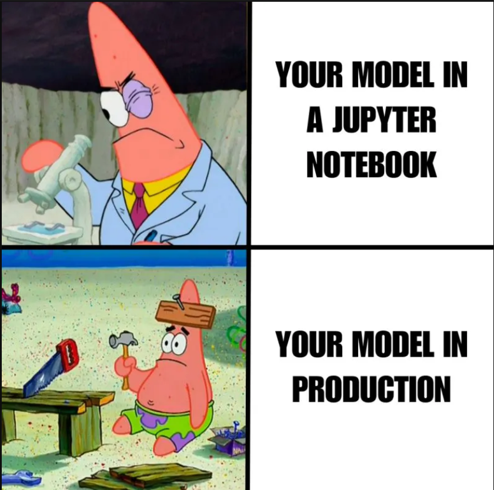

<h1 align = "center">We are IEEE-VIT. 🚀</h1>

  

  <b><i>IDEATE. INNOVATE. INSPIRE.</i></b>  

  IEEE VIT is a community comprising the most persevering of student developers, designers, and managers. Our ever-growing arsenal of projects covers a range of domains and technologies, from Web Development and App Development to Machine Learning and Electronics. 

  We 💙 open-source development. If you're here, chances are you do too! Contribute to our <a href="https://github.com/orgs/IEEE-VIT/repositories">projects</a>!  

---

  
    IEEE offers a range of exciting projects across diverse disciplines, ready for your innovative touch in 2026! 🥳

 

  <b>🌼 May @ IEEE VIT is about execution, refinement, and building with intent. ⚙️</b>

   
  Fresh ideas taking shape, stronger systems moving forward with clarity. 

   Cleaner workflows. Smarter iterations. Purposeful progress. 
  ✨ May isn’t just about moving fast, it’s about improving how we execute. From thoughtful planning to reliable pipelines, well tested features, and scalable systems, every commit reflects ownership, clarity, and intent. ✨

   
   “Great engineering is built through focus and consistency
   it grows through iteration, teamwork, and intent
   Strong systems. Clean execution. Purposeful progress
   Because when we build with clarity… every experience becomes stronger.”

  <a> 💻</a>

  <h3>Featured Project of the Month</h3>

  <b>BubbleHead</b>

   
  BubbleHead is a local first Retrieval Augmented Generation (RAG) system that prioritizes privacy, accuracy, and research friendly design. It combines ChromaDB for vector storage, BM25 for hybrid retrieval, and an iterative gap analysis engine to handle complex queries across multiple document formats.
   

   
  🔗 <b>Project Link:</b> <a href="https://github.com/IEEE-VIT/BubbleHead.git">View Project</a>
   

  <a href="https://youtu.be/oRdxUFDoQe0?si=c8kA8zKuzf3B87w_&t=107" target="_blank">🕺🏼</a>

