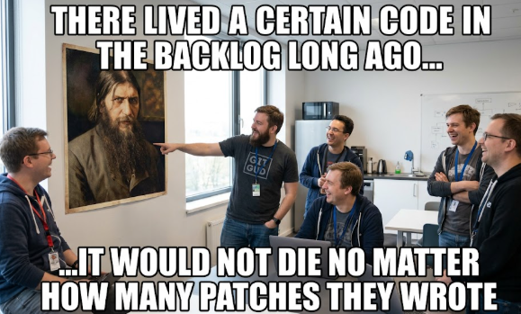

<h1 align = "center">We are IEEE-VIT. 🚀</h1>

  

  <b><i>IDEATE. INNOVATE. INSPIRE.</i></b>  

  IEEE VIT is a community comprising the most persevering of student developers, designers, and managers. Our ever-growing arsenal of projects covers a range of domains and technologies, from Web Development and App Development to Machine Learning and Electronics.

  We 💙 open-source development. If you're here, chances are you do too! Contribute to our <a href="https://github.com/orgs/IEEE-VIT/repositories">projects</a>!  

---

  
    IEEE offers a range of exciting projects across diverse disciplines, ready for your innovative touch in 2026! 🥳

 

  <b>🌞 June @ IEEE VIT is about momentum, collaboration, and building what lasts. 🚀⚙️</b>

   
  Fresh energy, stronger foundations, and systems that scale with purpose. Bolder ideas. Deeper ownership. Meaningful impact. ✨ 

   June isn't just about shipping faster. 
  ✨ It's about building smarter.
From cross functional collaboration to battle tested architectures, optimized pipelines, and features that hold under pressure, every line of code reflects ambition, craftsmanship, and teamwork. ✨

   
   “Great engineering is never built alone it grows through shared vision and collective effort.
   It scales through trust, curiosity, and the courage to iterate. Strong teams. Scalable systems. Lasting impact.
   Because when we build together… every solution becomes something bigger.”

  <a href="https://youtu.be/NJh5idlanrc?si=zkOhqTQIue8w5GML" target="_blank">🕺🏼</a>

 <h2>June's Project of the Month</h2>
    
  <b>
    <a href="https://github.com/IEEE-VIT/VevoNFT">VevoNFT</a>
  </b>

   
  VevoNFT is a decentralized NFT platform that prioritizes seamless deployment, secure asset sharing, and testnet reliability. It combines Solidity smart contracts for ERC-721 token standards, Pinata (IPFS) for immutable data storage via CID hashes, and an integrated blockchain workflow to handle minting, management, and transfers across Remix IDE and MetaMask.
   
   
      
  ## Features
  * **ERC-721 NFT Implementation:** Standardized Solidity contracts for unique digital assets.
  * **IPFS Content Addressing:** Integration of Pinata CID hashes to link NFTs to media files (images, videos, etc.).
  * **Minting & Sharing Logic:** Functions to create new tokens with specific metadata and transfer them between users.
  * **Remix-Ready Functions:** Interactive buttons within the IDE to trigger actions like `mint` (with CID input), `approve`, and `transfer`.
  * **Sepolia Testnet Integration:** Fully compatible with Ethereum's Sepolia network for risk-free testing.

   

  
    
  <b>Architecture Overview</b>
   
  End-to-end flow showing user interaction through MetaMask, smart contract execution on the Sepolia testnet, and decentralized media storage via Pinata/IPFS, all orchestrated through the Remix IDE.

